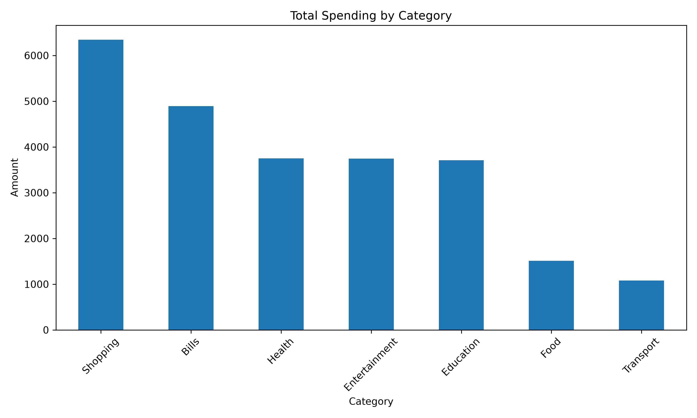
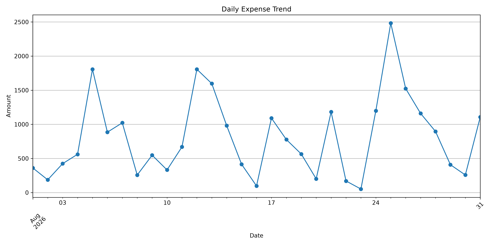
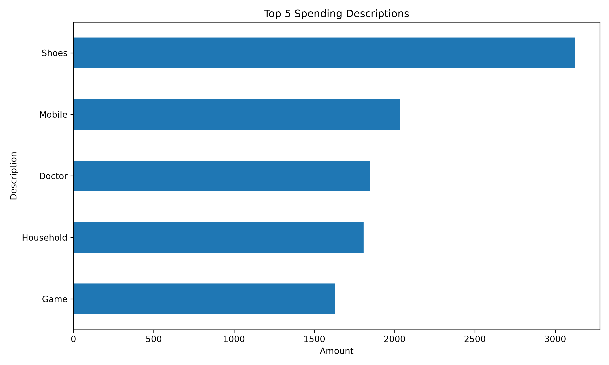

# Personal Expense Analyzer

A Python-based data analysis project that analyzes personal expenses using Pandas and Matplotlib.

## Features

- Total expense calculation
- Average transaction analysis
- Daily expense analysis
- Category-wise spending analysis
- Description-wise spending analysis
- Top 5 spending descriptions
- Highest and lowest expenses
- Expense visualization
- Automatic chart generation

## Technologies

- Python
- Pandas
- Matplotlib

## Project Structure

Personal-Expense-Analyzer/
│
├── data/
├── src/
├── outputs/
├── README.md
├── requirements.txt
└── .gitignore

## Analysis

The project analyzes:

- Total spending
- Average transaction
- Average daily spending
- Highest spending category
- Highest spending description
- Top 5 spending descriptions

## Visualizations

### Category Spending

### Daily Expense Trend

### Top 5 Spending

## How to Run

Clone the repository:

git clone YOUR_REPOSITORY_URL

Install dependencies:

pip install -r requirements.txt

Run:

python src/expense_analyzer.py
